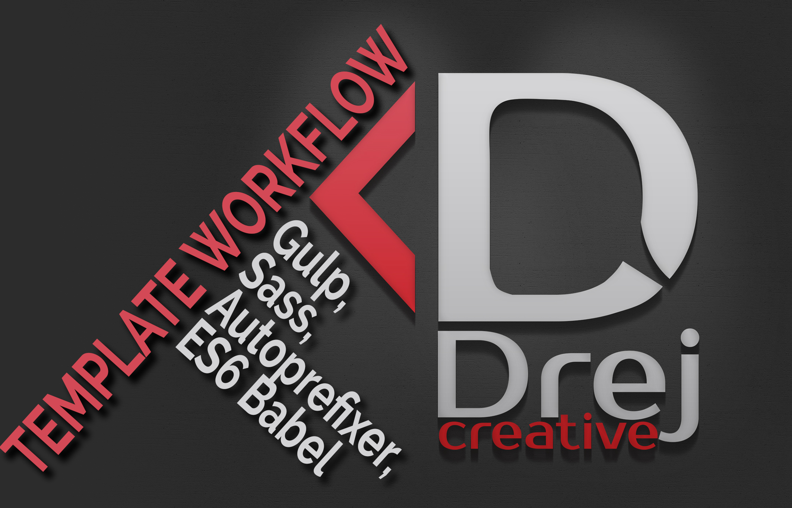

# Gulp Workflow

We've gone through the absolute basics of Gulp and created a workflow that's able to compile Sass into CSS while watching HTML and JS files for changes at the same time. We can run this task with the gulp command in the command line.

We've also built a second task, build, that creates a dist folder for the production website. We compiled Sass into CSS, optimized all our assets, and copied the necessary folders into the dist folder. To run this task, we just have to type gulp build into the command line.

Lastly, we have a clean task that clears away from the generated dist folder any image caches that are created, allowing us to remove any old files that were inadvertently kept in dist.

We've created a robust workflow so far that's capable enough for most web developers. There's a lot more to Gulp and workflows that we can explore to make this process even better. Here are some ideas for you:

#For development:

+ Using Autoprefixer to write vendor-free CSS code
+ Adding Sourcemaps for easier debugging
+ Creating Sprites with sprity
+ Compiling only files that have changed with gulp-changed
+ Writing ES6 with Babel or Traceur
+ Modularizing Javascript files with Browserify, webpack, or jspm
+ Modularizing HTML with template engines like Handlebars or Swig
+ Splitting the gulpfile into smaller files with require-dir
+ Generating a Modernizr script automatically with gulp-modernizr

#For optimization:

+ Removing unused CSS with unCSS
+ Further optimizing CSS with CSSO
+ Generating inline CSS for performance with Critical

In addition to development or optimization processes, you can also add write JavaScript unit tests with gulp-jasmine and even deploy your dist folder onto your production server automatically with gulp-rync.

##Instructions

Make sure you have these installed

1. [Node.js](www.nodejs.org).
2. [git](www.git-scm.com).
3. Gulp via the Mac terminal or Gitbash on a PC > `npm install -g gulp`

Clone this repository into your local machine using the terminal (mac) or Gitbash (PC)
`git clone  https://github.com/drejcreative/Template-for-Gulp-workflow.git`

CD to the folder with workflows
Run > `npm install` to install the project dependencies

Run the Gulp command > `gulp`

And add `http://localhost:3000` to you browser to live preview your work
